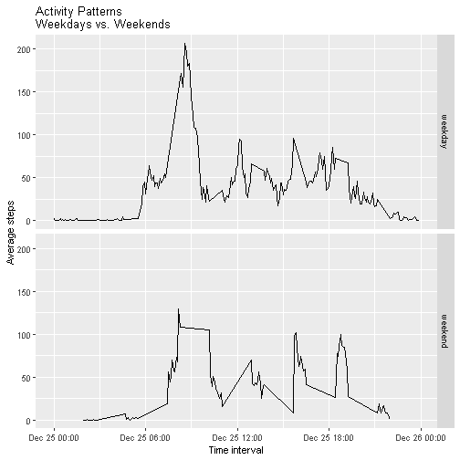

```r
library(knitr)
opts_chunk$set(tidy = TRUE)
```

## Loading and preprocessing the data
Load CSV file to import data

```r
setwd("D:/Documents/Training/John Hopkins Data Science/Course 5 - Reproducible Research/Project/Project 1/Reproducible_Research_1")
unzip("activity.zip")
activity <- read.csv("activity.csv", header = TRUE)
```

Preprocess the data:

```r
head(activity)
```

```
##   steps       date interval
## 1    NA 2012-10-01        0
## 2    NA 2012-10-01        5
## 3    NA 2012-10-01       10
## 4    NA 2012-10-01       15
## 5    NA 2012-10-01       20
## 6    NA 2012-10-01       25
```

```r
str(activity)
```

```
## 'data.frame':	17568 obs. of  3 variables:
##  $ steps   : int  NA NA NA NA NA NA NA NA NA NA ...
##  $ date    : Factor w/ 61 levels "2012-10-01","2012-10-02",..: 1 1 1 1 1 1 1 1 1 1 ...
##  $ interval: int  0 5 10 15 20 25 30 35 40 45 ...
```
Interval is integer and date is a factor. Change these data types to POSIX time and POSIX date.

```r
activity$date <- as.POSIXct(strptime(activity$date, "%Y-%m-%d"), tz = "")
activity$time <- sprintf("%04d", activity$interval)
activity$time <- as.POSIXct(activity$time, format = "%H%M", usetz = FALSE, tz = "")
# activity$time <- format(as.POSIXct(activity$time) ,format = '%H:%M:%S')
```

Check the data again

```r
head(activity)
```

```
##   steps       date interval                time
## 1    NA 2012-10-01        0 2018-12-25 00:00:00
## 2    NA 2012-10-01        5 2018-12-25 00:05:00
## 3    NA 2012-10-01       10 2018-12-25 00:10:00
## 4    NA 2012-10-01       15 2018-12-25 00:15:00
## 5    NA 2012-10-01       20 2018-12-25 00:20:00
## 6    NA 2012-10-01       25 2018-12-25 00:25:00
```

```r
str(activity)
```

```
## 'data.frame':	17568 obs. of  4 variables:
##  $ steps   : int  NA NA NA NA NA NA NA NA NA NA ...
##  $ date    : POSIXct, format: "2012-10-01" "2012-10-01" ...
##  $ interval: int  0 5 10 15 20 25 30 35 40 45 ...
##  $ time    : POSIXct, format: "2018-12-25 00:00:00" "2018-12-25 00:05:00" ...
```


## What is mean total number of steps taken per day?
For this part of the assignment, you can ignore the missing values in the dataset.

1. Calculate the total number of steps taken per day
2. If you do not understand the difference between a histogram and a barplot, research the difference between them. Make a histogram of the total number of steps taken each day
3. Calculate and report the mean and median of the total number of steps taken per day


```r
total_steps_per_day <- aggregate(list(total_steps = activity$steps), by = list(date = activity$date), 
    FUN = sum, na.rm = TRUE)
head(total_steps_per_day, 10)
```

```
##          date total_steps
## 1  2012-10-01           0
## 2  2012-10-02         126
## 3  2012-10-03       11352
## 4  2012-10-04       12116
## 5  2012-10-05       13294
## 6  2012-10-06       15420
## 7  2012-10-07       11015
## 8  2012-10-08           0
## 9  2012-10-09       12811
## 10 2012-10-10        9900
```

```r
library(ggplot2)
ggplot(total_steps_per_day, aes(x = total_steps)) + geom_histogram(fill = "orange", 
    bindwidth = 30) + labs(title = "Daily Step Count", x = "Steps", y = "Frequency")
```

```
## Warning: Ignoring unknown parameters: bindwidth
```

```
## `stat_bin()` using `bins = 30`. Pick better value with `binwidth`.
```


Calculate the mean and median number of steps per day

```r
mean_total_steps <- mean(total_steps_per_day$total_steps)
median_total_steps <- median(total_steps_per_day$total_steps, na.rm = T)

cat("Mean: ", mean_total_steps)
```

```
## Mean:  9354.23
```

```r
cat("Median: ", median_total_steps)
```

```
## Median:  10395
```

## What is the average daily activity pattern?
Use the aggregate() function to obtain the average number of steps for each time interval

```r
average_steps_by_time <- aggregate(list(average_steps = activity$steps), by = list(time = activity$time, 
    interval = activity$interval), FUN = mean, na.rm = TRUE)
plot(average_steps ~ time, data = average_steps_by_time, xlab = "Time interval", 
    ylab = "Mean steps", main = "Mean Steps By Time Interval", type = "l", col = "orange", 
    lwd = 2)
```


Find time interval with the maximum average number of steps

```r
max_average_steps <- which.max(average_steps_by_time$average_steps)

timeMostSteps <- gsub("([0-9]{1,2})([0-9]{2})", "\\1:\\2", average_steps_by_time[max_average_steps, 
    "interval"])

cat("Time Interval With Most Steps: ", timeMostSteps)
```

```
## Time Interval With Most Steps:  8:35
```

## Imputing missing values


```r
sum(is.na(activity[, "steps"]))
```

```
## [1] 2304
```

```r
imputed_value <- merge(activity, average_steps_by_time, by = "interval")

imputed_value <- within(imputed_value, steps <- ifelse(is.na(imputed_value$steps), 
    imputed_value$average_steps, imputed_value$steps))
total_steps_per_day_imputed <- aggregate(list(total_steps = imputed_value$steps), 
    by = list(date = imputed_value$date), FUN = sum, na.rm = FALSE)
```
Draw histograms showing the distribution of total steps (frequency and density) with the imputed values.

```r
# frequencies
par(mfrow = c(1, 2))
hist(total_steps_per_day_imputed$total_steps, breaks = 30, xlab = "Total Steps", 
    main = "Total Steps Per Day", col = "orange")
# density
plot(density(total_steps_per_day_imputed$total_steps, na.rm = TRUE), xlab = "Total Steps", 
    ylab = "Density", main = "Total Steps Per Day", col = "blue", lwd = 3)
```


```r
cat("Mean: ", mean(total_steps_per_day_imputed$total_steps))
```

```
## Mean:  10766.19
```

```r
cat("Median: ", median(total_steps_per_day_imputed$total_steps))
```

```
## Median:  10766.19
```
The mean and median total number of steps are now equal to one another and higher with the imputed values.

## Are there differences in activity patterns between weekdays and weekends?


```r
# Find Weekday
imputed_value$weekday <- weekdays(activity$date)

imputed_value$weekend_indicator <- as.factor(apply(imputed_value["weekday"], 
    1, function(x) {
        switch(x, Sunday = "weekend", Saturday = "weekend", "weekday")
    }))

str(imputed_value)
```

```
## 'data.frame':	17568 obs. of  8 variables:
##  $ interval         : int  0 0 0 0 0 0 0 0 0 0 ...
##  $ steps            : num  1.72 0 0 0 0 ...
##  $ date             : POSIXct, format: "2012-10-01" "2012-11-23" ...
##  $ time.x           : POSIXct, format: "2018-12-25 00:00:00" "2018-12-25 00:00:00" ...
##  $ time.y           : POSIXct, format: "2018-12-25 00:00:00" "2018-12-25 00:00:00" ...
##  $ average_steps    : num  1.72 1.72 1.72 1.72 1.72 ...
##  $ weekday          : chr  "Monday" "Monday" "Monday" "Monday" ...
##  $ weekend_indicator: Factor w/ 2 levels "weekday","weekend": 1 1 1 1 1 1 1 1 1 1 ...
```


```r
average_steps_by_time_weekend <- aggregate(list(average_steps = imputed_value$steps), 
    by = list(time = imputed_value$time.x, daytype = imputed_value$weekend_indicator), 
    FUN = mean)
qplot(x = time, y = average_steps, geom = "path", data = average_steps_by_time_weekend, 
    xlab = "Time interval", ylab = "Average steps", main = "Activity Patterns\nWeekdays vs. Weekends", 
    facets = daytype ~ .)
```




```r
library(psych)
by(average_steps_by_time_weekend, average_steps_by_time_weekend$daytype, FUN = describe)
```

```
## Warning in FUN(newX[, i], ...): no non-missing arguments to min; returning
## Inf
```

```
## Warning in FUN(newX[, i], ...): no non-missing arguments to max; returning
## -Inf
```

```
## Warning in FUN(newX[, i], ...): no non-missing arguments to min; returning
## Inf
```

```
## Warning in FUN(newX[, i], ...): no non-missing arguments to max; returning
## -Inf
```

```
## average_steps_by_time_weekend$daytype: weekday
##               vars   n  mean    sd median trimmed   mad min    max  range
## time             1 216   NaN    NA     NA     NaN    NA Inf   -Inf   -Inf
## daytype*         2 216  1.00  0.00    1.0    1.00  0.00   1   1.00   0.00
## average_steps    3 216 36.88 40.74   31.9   29.56 39.44   0 206.17 206.17
##               skew kurtosis   se
## time            NA       NA   NA
## daytype*       NaN      NaN 0.00
## average_steps 1.87     4.17 2.77
## -------------------------------------------------------- 
## average_steps_by_time_weekend$daytype: weekend
##               vars  n  mean    sd median trimmed   mad min    max  range
## time             1 88   NaN    NA     NA     NaN    NA Inf   -Inf   -Inf
## daytype*         2 88  2.00  0.00   2.00    2.00  0.00   2   2.00   0.00
## average_steps    3 88 37.72 33.42  38.17   34.78 44.85   0 129.43 129.43
##               skew kurtosis   se
## time            NA       NA   NA
## daytype*       NaN      NaN 0.00
## average_steps 0.54    -0.71 3.56
```
End of Assignment
